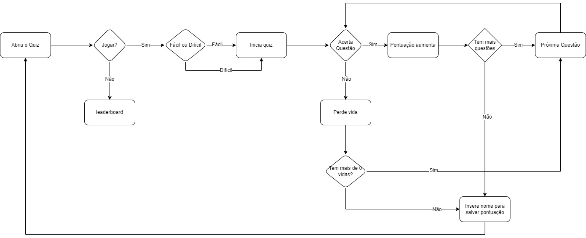

# Quiz Reblox - Fórmula E

## Integrantes

- **Nome**: Andrey | **RM**: 555339
- **Nome**: Henrique | **RM**: 554493
- **Nome**: Oliver | **RM**: 554954
- **Nome**: Pedro Gutierre | **RM**: 555445
- **Nome**: William | **RM**: 555132
## Descrição do Projeto

Este projeto consiste em um quiz interativo sobre a Fórmula E, desenvolvido em Python. O quiz tem como objetivo educar e entreter os usuários, aumentando o conhecimento sobre a Fórmula E de maneira gamificada. 

Os jogadores podem escolher entre dois níveis de dificuldade: fácil e difícil. Eles terão um número limitado de vidas e precisarão responder corretamente às perguntas para avançar no jogo. O projeto também inclui uma leaderboard que classifica os jogadores com base na pontuação e dificuldade escolhida.

Além disso, você pode aprender tudo o que precisa sobre a Fórmula E na experiência do Reblox no Roblox, onde um ambiente virtual imersivo recria o evento de uma corrida, incluindo a entrada, as lojas e, claro, a pista.

## Código

Este projeto é uma aplicação de quiz simples utilizando Streamlit. O usuário pode escolher entre duas dificuldades e competir por pontuações, que são salvas em um leaderboard.

## Estrutura do Código

O código é organizado em várias seções, cada uma responsável por uma parte específica da lógica da aplicação.

### Fluxograma



### 1. Importação de Módulos

```python
import streamlit as st
import perguntas
import time
```
- **Streamlit**: Biblioteca para criação de aplicações web interativas.
- **perguntas**: Módulo que contém as perguntas do quiz.
- **time**: Usado para gerenciar tempos de espera entre interações.

### 2. Inicialização de Variáveis de Estado

```python
if 'dificuldade' not in st.session_state:
    st.session_state.dificuldade = None
if 'perguntaAtual' not in st.session_state:
    st.session_state.perguntaAtual = 0
if 'pontuacao' not in st.session_state:
    st.session_state.pontuacao = 0
if 'vidas' not in st.session_state:
    st.session_state.vidas = 3
if "leaderboard" not in st.session_state:
    st.session_state.leaderboard = {"facil":[], "dificil":[]}
```
- O uso de `st.session_state` permite manter o estado da aplicação entre as interações do usuário.
- Variáveis para dificuldade, pergunta atual, pontuação, vidas e leaderboard são inicializadas.

### 3. Sidebar e Opções

```python
st.sidebar.title("Reblox")
opcao = st.sidebar.radio("Escolha uma opção:", ["Quiz", "Leaderboard"])
```
- Criação de uma barra lateral para navegar entre o quiz e o leaderboard.

### 4. Funções do Jogo

#### 4.1 `resetarJogo()`

```python
def resetarJogo():
    st.session_state.dificuldade = None
    st.session_state.perguntaAtual = 0
    st.session_state.pontuacao = 0
    st.session_state.vidas = 3
```
- Reseta o estado do jogo para os valores iniciais.

#### 4.2 `salvarPontuação(nome, pontuacao, dificuldade)`

```python
def salvarPontuação(nome, pontuacao, dificuldade):
    st.session_state.leaderboard[dificuldade].append({'nome': nome, 'pontuacao': pontuacao})
    st.success("Salvo com sucesso")
    resetarJogo()
    time.sleep(1)
    st.rerun()
```
- Salva a pontuação do jogador na categoria de dificuldade correspondente e reseta o jogo.

#### 4.3 `quiz()`

```python
def quiz():
    if st.session_state.vidas > 0 and st.session_state.perguntaAtual <= 9:
        st.write(perguntas[st.session_state.dificuldade][st.session_state.perguntaAtual]["pergunta"])
        for item in perguntas[st.session_state.dificuldade][st.session_state.perguntaAtual]["respostas"]:
            if st.button(item):
                if item == perguntas[st.session_state.dificuldade][st.session_state.perguntaAtual]["respostaCorreta"]:
                    st.success("Resposta correta!")
                    st.session_state.pontuacao += 1
                else:
                    st.error("Resposta incorreta!")
                    st.session_state.vidas -= 1
                if st.session_state.vidas > 0:
                    st.session_state.perguntaAtual += 1
                    time.sleep(1)
                    st.rerun()
                else:
                    st.error("Fim de jogo! Você perdeu todas as vidas.")
                    time.sleep(1)
                    st.rerun()
    else:
        name = st.text_input("Insira seu nome para salvar sua pontuação")
        if name:
            salvarPontuação(name, st.session_state.pontuacao, st.session_state.dificuldade)
```
- Exibe a pergunta atual e as respostas. Gerencia a lógica para verificar se a resposta está correta ou não, e reduz vidas conforme necessário.
- Quando as vidas se esgotam, solicita o nome do jogador para salvar a pontuação.

#### 4.4 `leaderboard()`

```python
def leaderboard():
    st.title("Leaderboard")
    st.write("Confira as melhores pontuações!")
    # Listagem das pontuações
```
- Exibe as melhores pontuações dos jogadores em duas categorias de dificuldade: fácil e difícil.

### 5. Função Principal `main()`

```python
def main():
    if opcao == "Quiz":
        if st.session_state.dificuldade is None:
            st.title("Quiz")
            st.write("Bem-vindo ao Quiz! Selecione a dificuldade e comece a jogar.")
            if st.button("Fácil"):
                st.session_state.dificuldade = "facil"
                st.rerun()
            if st.button("Difícil"):
                st.session_state.dificuldade = "dificil"
                st.rerun()
        else:
            st.write(f"Vidas: {st.session_state.vidas}")
            st.write(f"Pontuação: {st.session_state.pontuacao}")
            quiz()
    elif opcao == "Leaderboard":
        leaderboard()
```
- Controla a navegação entre o quiz e o leaderboard, inicializando o jogo se a dificuldade ainda não foi escolhida.

## Instruções de Uso

### Caso queria rodar localmente

1. **Clonar o Repositório**
   ```sh
   git clone https://github.com/seu-usuario/quiz-roblox-formula-e.git
   cd quiz-roblox-formula-e
   ```

2. **Baixar streamlit**
   Certifique-se de ter o Python instalado em sua máquina. Para baixar o streamlit na sua maquina:
   ```sh
   pip install streamlit
   ```

3. **Executar o Quiz**
   Certifique-se de ter o Streamlit instalado em sua máquina. Para iniciar o quiz, execute o seguinte comando:
   ```sh
   streamlit run main.py
   ```

4. **Responder às Perguntas**
   - Após iniciar o jogo, escolha a dificuldade (Fácil ou Difícil).
   - Responda às perguntas apertando a alternativa correta.

5. **Leaderboard**
   - No final do jogo ou quando o jogador ficar sem vidas ou terminar todas perguntas, será solicitado a inserir seu nome para adicionar à leaderboard.
   - A leaderboard mostra as pontuações dos jogadores, separadas por dificuldade.

## Estrutura do Código

- **main.py:** Arquivo principal contendo a lógica do jogo e a interação com o usuário.


